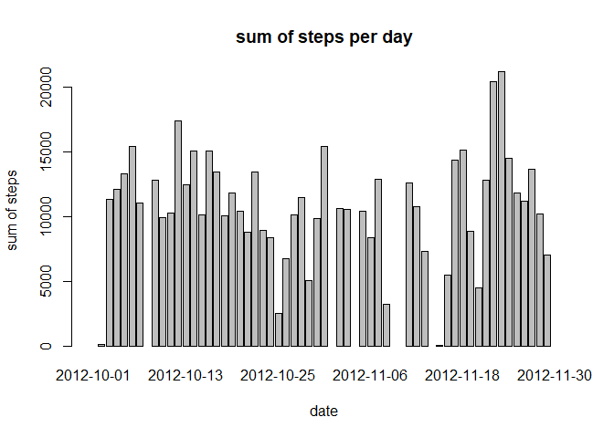
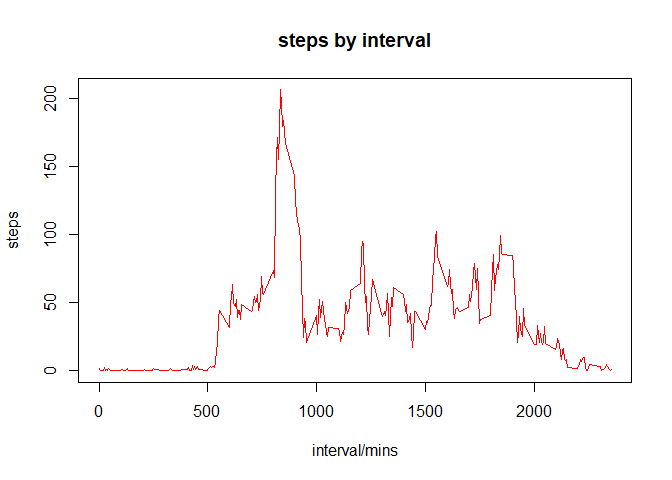
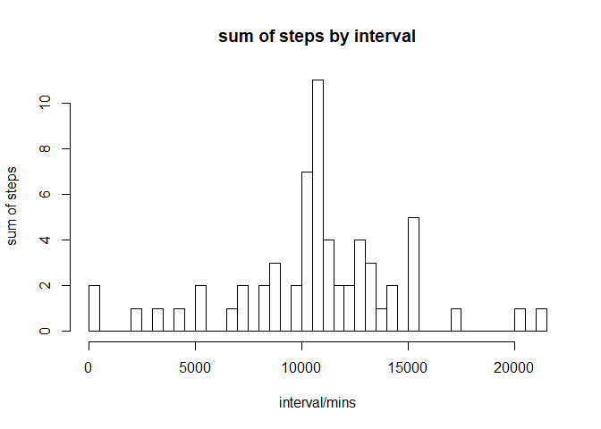
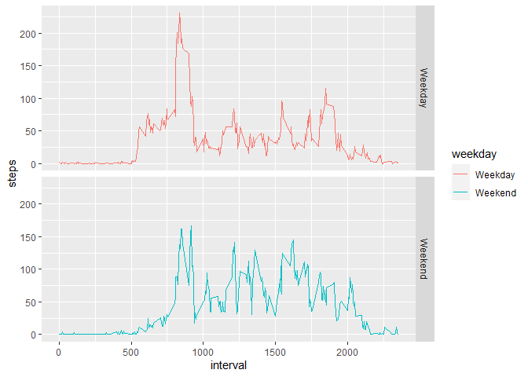

## Loading and preprocessing the data

```r
dat <- read.csv("activity.csv", header = T)
```
this is a subset without NAs  

```r
remove_na <- dat[!is.na(dat$steps),]
```
to convert the date to class date:  

```r
dat$date <- as.Date(as.character(dat$date))
```

## What is mean total number of steps taken per day?

calculate and show the sums of steps for the first 10 days

```r
sum_steps <- aggregate(dat$steps, by = list(dat$date), FUN = sum)
colnames(sum_steps) <- c("date", "sum_of_steps")
head(sum_steps, 10)
```

```
##          date sum_of_steps
## 1  2012-10-01           NA
## 2  2012-10-02          126
## 3  2012-10-03        11352
## 4  2012-10-04        12116
## 5  2012-10-05        13294
## 6  2012-10-06        15420
## 7  2012-10-07        11015
## 8  2012-10-08           NA
## 9  2012-10-09        12811
## 10 2012-10-10         9900
```

here it is a bar plot of the sum of steps per day  

```r
barplot(height = sum_steps$sum_of_steps, names.arg = sum_steps$date ,xlab = "date" , ylab = "sum of steps", main = "sum of steps per day")  
```

<!-- -->

here it is the summary of the sum of steps per day (mean, median) 

```r
summary(sum_steps$sum_of_steps)
```

```
##    Min. 1st Qu.  Median    Mean 3rd Qu.    Max.    NA's 
##      41    8841   10765   10766   13294   21194       8
```

## What is the average daily activity pattern?

create a subset of the means of steps by interval  

```r
meanstep <- aggregate(remove_na$steps, by = list(remove_na$interval), FUN = mean)
colnames(meanstep) <- c("interval", "steps")
```

here it is a plot of the steps against interval

```r
plot(meanstep$interval, meanstep$steps, type = "l", col = "red", xlab = "interval/mins", ylab = "steps", main = "steps by interval")
```

<!-- -->

the maximum number of steps by 5-min interval is at:  

```r
meanstep[meanstep$steps == max(meanstep$steps),]
```

```
##     interval    steps
## 104      835 206.1698
```

## Imputing missing values

the total number of missing values:  

```r
sum(is.na(dat$steps))
```

```
## [1] 2304
```

mean for that 5-min interval will be used to fill in all missing entries:

```r
filled_dat <- dat
to_be_filled <- filled_dat$interval[is.na(dat$steps)]
filler <- meanstep$steps[match(to_be_filled, meanstep$interval)]
missing <- which(is.na(dat$steps))
filled_dat$steps[missing] <- filler
head(filled_dat, 10)
```

```
##        steps       date interval
## 1  1.7169811 2012-10-01        0
## 2  0.3396226 2012-10-01        5
## 3  0.1320755 2012-10-01       10
## 4  0.1509434 2012-10-01       15
## 5  0.0754717 2012-10-01       20
## 6  2.0943396 2012-10-01       25
## 7  0.5283019 2012-10-01       30
## 8  0.8679245 2012-10-01       35
## 9  0.0000000 2012-10-01       40
## 10 1.4716981 2012-10-01       45
```

histogram of the total number of steps taken each day:  

```r
sum_steps2 <- aggregate(filled_dat$steps, by = list(filled_dat$date), FUN = sum)
colnames(sum_steps2) <- c("date", "sum_of_steps")
hist(sum_steps2$sum_of_steps, xlab =  "interval/mins", ylab = "sum of steps", main = "sum of steps by interval", breaks = 40)  
```

<!-- -->

summary of total number of steps taken per day (mean, median):

```r
summary(sum_steps2$sum_of_steps)
```

```
##    Min. 1st Qu.  Median    Mean 3rd Qu.    Max. 
##      41    9819   10766   10766   12811   21194
```

compare before and after filling in missing values:

```r
summary(sum_steps$sum_of_steps[!is.na(sum_steps$sum_of_steps)])
```

```
##    Min. 1st Qu.  Median    Mean 3rd Qu.    Max. 
##      41    8841   10765   10766   13294   21194
```

```r
summary(sum_steps2$sum_of_steps)
```

```
##    Min. 1st Qu.  Median    Mean 3rd Qu.    Max. 
##      41    9819   10766   10766   12811   21194
```

Do these values differ from the estimates from the first part of the assignment? What is the impact of imputing missing data on the estimates of the total daily number of steps?  
Ans: median has been moved toward the mean while the mean remains the same when the missing values are imputed.

## Are there differences in activity patterns between weekdays and weekends?

Create a new factor variable in the dataset with two levels

```r
filled_dat$weekday <- weekdays(filled_dat$date)
filled_dat$weekday <- ifelse(filled_dat$weekday == "Saturday" | filled_dat$weekday == "Sunday", "Weekend", "Weekday")
filled_dat$weekday <- as.factor(filled_dat$weekday)
```

here to make a panel plot

```r
meanstepweekday <- aggregate(filled_dat$steps, by = list(filled_dat$weekday, filled_dat$interval), mean)
colnames(meanstepweekday) <- c("weekday", "interval", "steps") 
library(ggplot2)
```

```
## Warning: package 'ggplot2' was built under R version 3.6.3
```

```r
qplot(interval, steps, data = meanstepweekday, facets = weekday~., geom = "line", colour = weekday)  
```

<!-- -->

Differences: there are constant fluctuations of steps in the midst of the day during weekends, which are more significant compared to those during weekdays.
